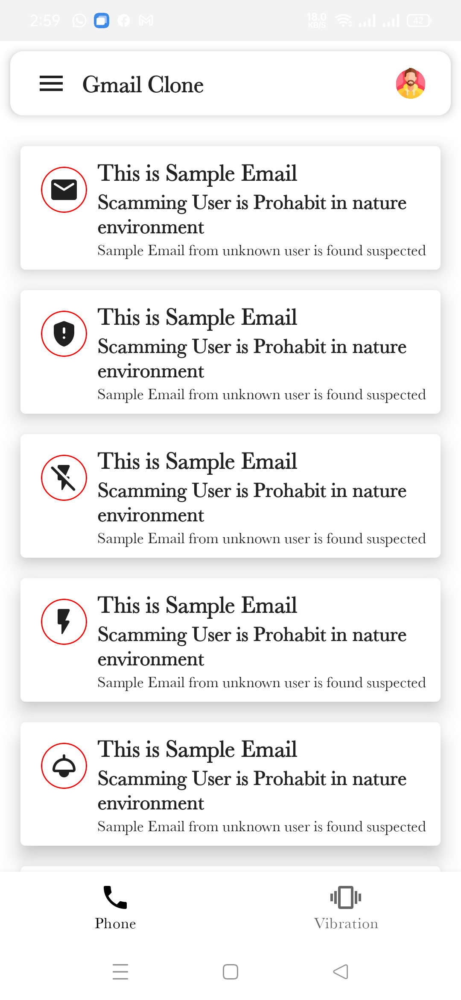

# Android Jetpack Compose Sample App.

## Whole App SS
Main Landing Screen | Responsive Image View | Gmail Mok Item List
:--:|:--:|:--:|
||
Side Drawer Open |Pop Up Dialog | Navigation Through NavController
||

## Portrait View

## LandScape View

## Where To go From here
*   Learning PathWays for jetpack compose  [Google About Jetpack compose](https://developer.android.com/courses/pathways/compose) instead.
*   Constraint , GuideLines ,  layout management for jetpack Compose [Constraint Layout For Compose](https://proandroiddev.com/getting-started-with-constraint-layout-in-jetpack-compose-48d4e02b76fd) .
*   Check out the [Google Official ](https://developer.android.com/jetpack/compose/documentation)
*   Sample Project For jetpack Compose [Compose Samples](https://github.com/android/compose-samples)

